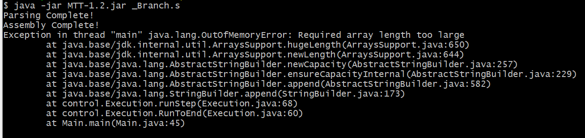
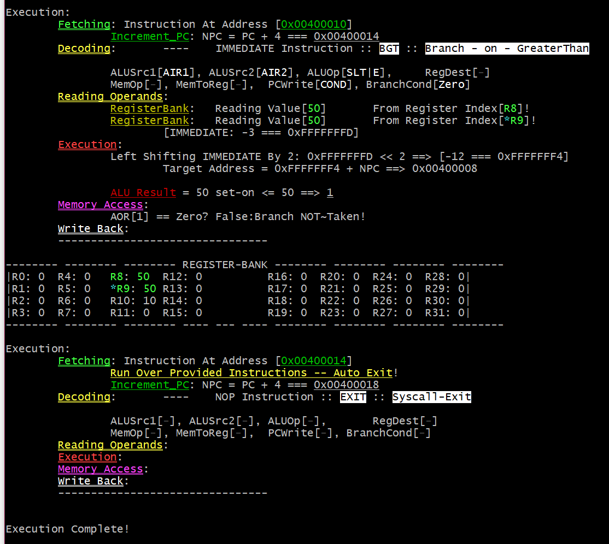

# Executing the Jar File

This application requires Java Runtime Environment 11 LTS.

You can use [Oracle SE 11](https://www.oracle.com/java/technologies/javase-downloads.html) or [openjdk-11-jre](https://adoptopenjdk.net/releases.html).

Please make sure you have this installed before attempting to run the application.

`Future builds may be a standalone package installation.`

------

To run the executable jar file run:

> **java -jar *MTT-1.0.jar*** <file>

If no path is specified it defaults to ***"FileInput.s"*** in the present-working-directory (pwd).

**File must end in *.s*, *.asm* or *.txt* extension!**


- `With PowerShell/CMD there is no colour in the output, and you need to use backslashes '\' between directories.`
- `Git-Bash uses the '/' directory seperator.` But does support Colour.
- `Consider using WSL on windows.` 
  - (the default WSL terminal does not support Anscii double-underline. Windows Terminal does)

## Change Log
#### Ver1.2.1 - RanOutOfMemory Patch
 - Output was being stored and only printed at the end of execution.

     -  This meant if a user ran a log of instructions. Or a very large /infinite loop. Java would run out of memory before printing the execution.

     -  This has been changed, to print the output of the console each cycle.

        

 - Use of ANSCII formatting has been made more consistent in the output

   


#### Ver1.2 - Branch Instructions Support

- Error Thrown if Jump/Branch loop back to themselves. (Infinite loop, determinable at assembly)
  
  - Known Bug: Error is not thrown if Jump is specified with Immediate instead of Label.
  
- New Branch Instructions Added!
  - **beq**  `$rs, $rt, offset/label`
  - **bne**  `$rs, $rt, offset/label`
  - **blt**  `$rs, $rt, offset/label`
  - **bgt**  `$rs, $rt, offset/label`
  - **ble**  `$rs, $rt, offset/label`
  - **bge**  `$rs, $rt, offset/label`
  
- BranchCond - Branch Condition {Zero, Not~Zero}, and PCWrite dependent of Cond Control Signals.

  

- Changed Write Colour back to Cyan as it is easier to read on darker terminals.
  
  - May manually specify background colours in future for a consistent view.
  
- Made Instruction Format more clear in the README.

- Full Name of Instruction is now printed during decode.

- Internal Changes to make Adding instructions easier.


#### Ver1.1 - Refactor to Pipeline Components

- Output now better segments the stages of execution (Fetch->Decode->Execute->Memory->WriteBack)

- Internal changes, to better accurately represent and emulate computer architecture.
- Execution is combined, and determined by control signals calculated during the Decode Stage.

- Filename is now required to use an appropriate file extension. (.s or .asm are preferred)

  

## Feedback

You may suggest new features/give feedback by leaving a comment on an issue.

------

> | Users should always be careful before running software downloaded from GitHub. |
> | :----------------------------------------------------------: |
> | This software is covered by the [MIT License](https://github.com/EDEN786/MIPS-Teaching-Tool/blob/Development/LICENSE) exempting the author from liability. |
> | Please read and understand the License before continuing to run this software on your personal machine. If you are uncomfortable running this software on your personal machine but would still like to provide feedback, contact a member of the research team, to arrange something. |


### Arbitrary limits @see( [**Known_Inaccuracies**](#Known-Inaccuracies) )

****

> These may change in future releases after doing more testing.

- `MAX_FILE_LENGTH = 512` (Lines)

- `MAX_INS_COUNT = 256` (Instructions)  *up to 257 instructions when including the auto Exit.

- `MAX_DATA_SEGMENTS = 256` (arbitrary limit for testing purposes)

MEMORY DATA Segments are doubleWord addressable (multiple of 8) to facilitate and simplify future double-precision float support.

	This makes the last supported addressable block of memory 0x100107F8

WORDS are all presumed to be signed (32bit) integers. This is to match Java's built in Integer data type.

Support for more data types (single-precision float, doubleWords, half-words, bytes) could be implemented in the future. But complete support of the MIPS ISA is not main focus of the application.

- [***Supported Instructions*** ](#Supported-Instructions)
- [***Operands Format***](#Operands-Format)
- [***Operands***](#Operands)
- [***Registers***](#Registers)
- [***Labels***](#Labels)

# Standard use:

	All input is made lowercase when parsed. This means ($ZERO, $Zero, $zero) are all treated the same.

## Supported Instructions:

> Format: **[OpCode]**\<Whitespace\>**[Operands]**

- R_type
  - **ADD**    `$rd, $rs, $rt`    Addition
  
  - **SUB**    `$rd, $rs, $rt`    Subtraction
  
- I_type
  - **ADDI**    `$rt, $rs, IMM`    Addition
  
  - **LW**    `$rt, IMM($rs)`    Load Word ; (pseudo) `$rt, Label`
  
  - **SW**    `$rt, IMM($rs)`    Store Word ; (pseudo) `$rt, Label`
  
    > **LI** workaround, specify the IMM value in data with a label pointing to it:
    >
    > imm_1:  .word 37687		# Note, Values in .Data need to be base10 Integers.
    >
    > Read the IMM from Memory using the label:
    >
    >  LW $rt, imm_1      # pseudo instruction. 

- I_type: Branches

  - BEQ    `$rs, $rt, IMM`    Branch On Equals ; (pseudo) `$rs, $rt, Label`
  - BNE    `$rs, $rt, IMM`    Branch On NOT~Equal ; (pseudo) `$rs, $rt, Label`
  - BLT    `$rs, $rt, IMM`    Branch On Less-Than ; (pseudo) `$rs, $rt, Label`
  - BGT    `$rs, $rt, IMM`    Branch On Greater-Than ; (pseudo) `$rs, $rt, Label`
  - BLE    `$rs, $rt, IMM`    Branch On Less-Than Or Equals ; (pseudo) `$rs, $rt, Label`
  - BGE    `$rs, $rt, IMM`    Branch On Greater-Than Or Equals ; (pseudo) `$rs, $rt, Label`

  > There is No Branch Delay Slot.  Branches Update the PC instantly.

  

- J_type
  
  - **J**    `Address/Immediate`    Jump ; (pseudo) `Label`
  - **JAL**    `Address/Immediate`    JumpAndLink ; (pseudo) `Label`
  	- Register $ra is overwritten by JAL
  
  > JR is planned. It is necessary for returning to the address linked to by JAL
  
  
  
- Other
  
  - **HALT**    ; No Operands
  
  - **EXIT**    ; No Operands - same as HALT
  
    

#### **Pseudo instructions are not accurately executed**!!!

	- At the moment the assembler does not replace Pseudo instructions with REAL instructions, Keep this in mind when writing code.

## Operands Format:

<,\s*> - mean comma ',' followed by 0 or more whitespace '\s*'.

 [@See **Supported Address Segments**](#Supported-Address-Segments)

| Operands Type:          | Operand 1                  | <,\s*>    | Operand 2             | <,\s*>    | Operand 3               |
| ----------------------- | -------------------------- | --------- | --------------------- | --------- | ----------------------- |
| **`$rd, $rs, $rt`**     | **[Destination_Register]** |           | **[Source_Register]** |           | **[Third_Register]**    |
|                         |                            |           |                       |           |                         |
| `$rt, $rs, IMM`         | **[Third_Register]**       |           | **[Source_Register]** |           | _[Immediate]_ 16bit     |
|                         |                            |           |                       |           |                         |
| **`$rt, IMM($rs)`**     | **[Third_Register]**       |           | _[Offset]_ 16bit      | _**N/A**_ | (**[Source_Register]**) |
| **`$rt, Label`**        | **[Third_Register]**       |           | [Label]               | _**N/A**_ | _**N/A**_               |
|                         |                            |           |                       |           |                         |
| **`$rs, $rt, IMM`**     | [Source_Register]          |           | [Third_Register]      |           | _[Offset]_ 16bit        |
| **`$rs, $rt, Label`**   | [Source_Register]          |           | [Third_Register]      |           | [Label]                 |
|                         |                            |           |                       |           |                         |
| **`Address/Immediate`** | _[Address]_ 26bit          | _**N/A**_ | _**N/A**_             | _**N/A**_ | _**N/A**_               |
| **`Label`**             | [Label]                    | _**N/A**_ | _**N/A**_             | _**N/A**_ | _**N/A**_               |

## Operands:

> [Destination_Register]/[Source_Register]/[Third_Register]

 - _**[Third_Register]**_ $rt can be the Destination or Source register for I_type instructions.

 - _**[Immediate]**_ Must be a valid signed 16bit integer.

 - _**[Offset]**_ is an _[Immediate]_ value. ∴ Must also be a valid signed 16bit integer.

	- Offsets used in branches are multiplied by 4, to force them to align with instruction addresses.

	- This is not done for load/store, as in other implementations memory is byte addressable.

		- It is up to the user to ensure offsets used with Load/Store are doubleWord (8bytes) addressable.

		- Meaning the Offset+$RS_Val is a multiple of 8.

 - _**[Address]**_ Must be a valid unsigned 28bit integer.

- _Labels_ are Strings, which reference an address. - they are converted into [Immediate] values at assembly. [@see Labels](#Labels)
   - for `LW/SW` the address is not checked at Parse/Assembly.
       - At execution, the address loaded into a register, MUST be valid for the instruction.

## Registers:

| Implemented   | Number |    Name    | Purpose                                        | Preserved*[2] |
| ------------- | :----: | :--------: | ---------------------------------------------- | ------------- |
| **Yes**\*[0]  |   0    |    ZERO    | Always equal to zero;                          | _**N/A**_     |
| NO \*[1]      |   1    |     AT     | Assembler temporary; used by the assembler     | NO            |
| **Yes** \*[2] |  2-3   |   V0-V1    | Return value from a function call              | NO            |
| **Yes** \*[2] |  4-7   |   A0-A3    | First four parameters for a function call      | NO            |
| **Yes**       |  8-15  |   T0-T7    | Temporary variables;                           | NO            |
| **Yes**       | 16-23  |   S0-S7    | Function variables;                            | **YES**       |
| **Yes**       | 24-25  |   T8-T9    | Two more temporary variables                   | NO            |
| NO            | 26-27  |   K0-K1    | Kernel use registers;                          | NO            |
| NO            |   28   |     GP     | Global pointer                                 | **YES**       |
| NO \*[2]      |   29   |     SP     | Stack pointer                                  | **YES**       |
| NO \*[3]      |   30   | ~~FP/~~ S8 | ~~Stack frame pointer or~~ subroutine variable | **YES**       |
| **Yes** \*[2] |   31   |     RA     | Return address of the last subroutine call     | **YES**       |

	 - [0] Using this register as a destination register, is effectively a "nop". - Warnings are issued in parsing phase.
	 - [1] Used by assembler to recode pseudo instructions into actual ones. Avoid using yourself.
	    - pseudo instructions not currently broken down - hence not used by assembler in current build.
	 - [2] Function Calls not tested/ Implemented, Therefor StackPointer disabled until this is tested.
	 - [3] FramePointer not implemented, reference this register as $s8 if used named referencing.
		- "FP" name for referencing not supported atm.

Registers can be referenced by name (e.g. $s2, $t0, $zero) or R_Number (e.g. $r18, $r8).

	Altough it is prefered register references start with a '$', This is not strictly required.

## Labels:

Labels must start with a letter (a-z/A-Z) (The application is case-insensitive), or Underscore '_'

 - periods,hyphens and underscores '.','-','_' may be used in a label name for readability.
 - Numbers can be used in a label.
 - no other symbols can be used, and spaces are not allowed. 
 - Label references are parsed for errors after instructions are parsed.

In the place of a label operand for an instruction a Hexadecimal address may be written instead, or the address as a decimal number.

 - Hexadecimal values must start with "0x".

> Where a label is used as an operand it must not contain a colon ':' at the end!

### Supported Address Segments:

Labels are converted into addresses at assembly after all the code has been parsed.

Jump and Branch instructions can reference Labels directed to instruction address space.

Load and Store instructions can reference Labels directed to data address space.

`Code segments 0x00400000 to 0x00500000 in steps of 4, 2^18 valid segments`

`Data segments 0x10010000 to 0x100107F8 in steps of 8, 2^8 valid segments`

Only 256 (2^8) instructions supported, (which is a maximum address of 0x004003E8).

Jumping to this gap, where the address is supported, but can't possibly contain an instruction. 
 The Application will think it has overran and automatically run an Exit instruction.

And An Exit ('halt') instruction will automatically be ran next.

###### MIPS Register addressing:

	Allows a full 32bit address to be loaded into a register.
	Then jump instructions / Load&Store use the address stored in the register.
	
	This introduced a runtime address hazard not detectable by the parser.
	The value of the register is determined at runtime.
	In the Execution Phase the address read from the instruction can be checked to be valid.

###### MIPS Base addressing: - Base+Offset

I_Type

- Offset(base) - Valid Data Address - Offset Addressing.

Label

- 	Branch - Converted to Offset.
- 	Load/Store - Pseudo Instruction -Direct Address (will be adjusted in future build)

###### MIPS Direct addressing:

J_Type

- Address - Valid Code Address - Pseudo Direct Addressing.
- Label directed to a code address. e.g. "main",

## Branch Delay Slots:

The current build executes a very basic model and Jump instructions update the PC in the same cycle (instead of being delayed). This means jumps are taken instantly.

>  **! This behaviour is expected to change in the next build!**

## Control Signals

| **Destination** {0-2} | If RD/ RT or fixed value $31 is selected to write to         |
| --------------------- | ------------------------------------------------------------ |
| **ALUSrc1** {0-1}     | AIR1 or NPC                                                  |
| **ALUSrc2** {0-1}     | AIR2  or Immediate Value                                     |
| ALUOp {0-7}           | Arithmetic Operation to perform.   NOP - No Operation, passes Input1 through |
| **Memory** {0-1}      | Memory Action: Read/Write  {Load to LMDR/ Store from SVR}    |
| **MemToReg** {0-1}    | If Memory Output (LMDR) or AOR is forwarded to Register Bank Write (Data) |
| **PCWrite** {0-1}     | Value PC is updated to, NPC or Immediate Value (Left Shifted 2) |

- **AIR**: ALU Input Register == RegisterBank Output
- **LMDR**: Load Memory Data Register
- **SVR**: Store Value Register (Data from RT)
- **NPC**: Next Program Counter (PC+4)

# End of User Manual

## Error/Warning messages:

### Valid File Checks:

	Check - File Exists
	Check - File is accessible (not being used by another resource)
	Check - File Length
	
	If any of these fails, the application will terminate.
		(future versions may allow selecting a new file).

## Parsing & Assembly:

> **Whitespace is trimmed, and case is converted to lowercase.**
> Parser checks file contains no syntactical errors.

	Comments:	Segment of the line after a pound'#' or semi-colon';' symbol.
	Labels:		Segment of the line before a colon':' symbol. {can start with a underscore_ or letter}
	
	Directives: Segment of the line before space seperator, Starts with a period '.'
	Values: 	Segment of the line after space seperator. Can contain a 'colon', or decimal point. and be comma seperated list.
	
	OpCode:		Segment of the line before space seperator, That Does Not! Start with a period '.'
	OpCode:		Segment of the line after space seperator.
		Registers:	usually start with a $, but don't have to.
		Immediates:	continuous stream of digits.	- atm, only Integer is supported.
			Hex Immediates: differentiated by "0x" sign at the beginning.
		Label-Op:	Same as above labels, but without the colon ":" at the end.
	
	From this the Parser builds a model:
	Directive					(.data, .text, .code)
		\
		Comments				(comments can begin with a pound sigh '#', or semicolon ';')
		   \					(comments are not used in any way by the application)
			\					
			Labels				(Labels must end with a colon ':')
				\
				Sub_Directive	(.word //future support for .double planned)
				|	\
				|	Values		(single int, int:range, int_array)
				|	
				OpCode			(see list of supported instructions)
					\
					Opperands	(depends on instruction type^)
						\
						Extra
				- Any extra characters past the last opperand, but not part of the comments
					- will break the formatting, and it will think the operands are invalid
	
	No Instructions are read:
		And Error is Reported at Assembly.
	
	Over 256 Instructions are read:
		A Warning will be issued And no further instructions will be parsed.
		
	If no EXIT/'halt' instruction is read:
		At Runtime, one will automatically be appended to the end.
		"Ran Over Provided Instructions"

Parser will not stop after an error is thrown.

It will attempt to parse the remainder of the lines checking for additional errors.

> **However - It will not attempt Assembly or Execution.**

### Assembly

During Assembly the real address a label points to is calculated.

Labels point to the next valid data/instruction from where it was defined.

> This can cause a scenario where a label was intended to point to data on the same line.
>	But due to an error with the data formatting it is not recognised.
>	Then the label will incorrectly be attached to the next instruction.

It will not continue to Execution, if there are errors at Assembly.

## MIPS Addresses Segments:

This application is inspired by [MARS](http://courses.missouristate.edu/kenvollmar/mars/) and tries to replicate its memory layout.

So it is easier for users to transition.

```
*  Code range (.text) 0x00400000 to 0x004FFFFF (4194304 to 5242879)
*  
*  Global Data (.data) 0x10010000 to 0x1003FFFF (268500992 to 268697599)
*  Heap data 0x10040000 to 0x1FFFFFFF (268697600 to 536870911)
*  Stack data 0x70000000 to 0x7FFFFFFF (1879048192 to 2147483647)
* 
*  In powers:
*      0x00400000:(2^22)       >= Code     <0x00500000:(2^22 +2^20)
*      0x10010000:(2^28 +2^16) >= Global   <0x10040000:(2^28 +2^18)
*      0x10040000:(2^28 +2^18) >= Heap     <0x20000000:(2^29)	- Not Supported
*      0x70000000:(2^31-2^28)  >= Stack    <0x80000000:(2^31)	- Not Supported
```

	.data segment usually has a size of 49152 word address (2^15+2^14). Addresses 0x10010000 to 0x1003FFFC.
		As double words this becomes 24576 doubleword address (2^14+2^13). Addresses 0x10010000 to 0x1003FFF8.

_Hex notation 0xXXXXXXXX (8 digits = 32bit Address)_

# Known Inaccuracies

The application currently does not support the CoProcessors.

Meaning it does not support Traps (Exceptions) or Functional Units.

There are known bugs with colour output especially.

@see [Known Bugs](https://github.com/EDEN786/MIPS-Teaching-Tool/projects/1#column-13528075)

# In-Progress

Branches are being added first.

Then, Functional Unit support is planned.

Then, Scoreboard DLX architecture.
